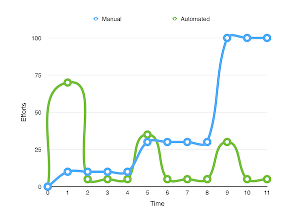

class: center, middle

#TDD เปลี่ยนชีวิตคนคนนี้ยังไง
###barcampsk4 @tuber

---
class: center, middle

# TDD =  Test Driven Developement
## Test + Driven

---

# Me?

.right[]

```sh
$ who
> ibot.out
> http://fb.me/botblogblog
> https://github.com/ibotdotout
```
--

```sh
$ do
> Vim
> Git
> Python
> Automated Testing
> Automated Workflow
> Dev-ops
> Docker
> Agile / XP
```

---

class: center, middle
# Life with/without TDD

---
# Life without TDD

.right[]

- Programming is boring

- Testing is painful

- Debug is hell !!!

- Bug is features WTF !!!

---

# Life with TDD

.right[]

- Programming is fun

- Testing, what is this ?

- Debug is challenge !!!

- Bug is friend !!!

---
class: center, middle

# TDD =  Test Driven Developement
## Driven - (Design your) test frist

---

# Why (desing your) test first

<iframe width="560" height="315" src="https://www.youtube.com/embed/AbSehcT19u0" frameborder="0" allow="accelerometer; autoplay; encrypted-media; gyroscope; picture-in-picture" allowfullscreen></iframe>

---

class: center, middle

# Give me cut_grade program !!!
## what ? 80 get A , 70 get B, 49 get F

---

# What programmer do ?

###Start with Coding
```sh
#!/usr/bin/env python3

score = int(input())

if score >= 80:
    print('A')
elif score >= 70:
    print('B')
elif score >= 60:
    print('C')
elif score >= 50:
    print("D")
else:
    print("F")
```

---
# Specfication of cut_grade

.right[]

- score range 0 - 100
- 80 <= score <= 100 get A
- 50 <= score < 80   get B
- 0 <= score < 50    get F

--

# Testcase

- score 100 should get A
- score 80 should get A
- score 79 should get B
- score 50 should get B
- score 49 should get F
- score 0 should get F

---
# Benefit of (design your ) test first

- ## Think What not How ?
-- Think what it does, not how it implement.
- ## Focus on your task and Prevent Over Design
-- Do The Simplest Thing That Could Possibly Work #DTSTTCPW

---

class: center, middle

# TDD =  Test Driven Developement
## Test - Automated (Unit) Testing

---
# Testing Levels
.center[]

---

class: center, middle
# Unit Testing
## Manual vs Automated

---
# Manual Unittest

There are only 3 grades: A, B, F

```sh
$ python cut_grade.py
> 81
A
> 70
B
> 49
F
```
--
Improve to have 5 grades: A, B, C, D, F

--
```sh
$ python cut_grade.py
> 60
C
> 55
D
```
Test only task you work !!!

---

# Automated Unittest
There are only 3 grade: A, B, F
```sh
$ nosetests tests/cut_grade_test.py -v
test_give_81_should_be_A ... passed
test_give_70_should_be_B ... passed
test_give_49_should_be_F ... passed
---------------------------------------------
3 tests run in 0.0 seconds (3 tests passed)
```
--
Improve to have 5 grades: A, B, C, D, F
```sh
$ nosetests tests/cut_grade_test.py -v
test_give_81_should_be_A ... passed
test_give_70_should_be_B ... passed
test_give_60_should_be_C ... failed
test_give_55_should_be_D ... passed
test_give_49_should_be_F ... passed
---------------------------------------------
5 tests run in 0.0 seconds (4 tests passed)
```
Test it All
---
# How automate test look like ?

```python
# AAA - Arrange Act Assert

def test_score_81_get_A(self):
  # Arrange
  score = 81

  # ACT
  grade = cut_grade(score)

  # Assert
  self.assertEqual('A', grade)

def test_score_70_get_B(self):
  score = 70
  grade = cut_grade(score)
  self.assertEqual('B', grade)

def test_score_49_get_F(self):
  score = 49
  grade = cut_grade(score)
  self.assertEqual('F', grade)
```
---
# Test Effort
- Blue - Manual,   Green - Automated
- Add new test on 1, 5, 9
.center[]

---

# Benefit of Automated Testing

- ## Know your software is working
-- code workin ?  
-- work on system / device / dependency version ?  
- ## Fast feedback
-- easy to fix
- ## Testcase as a document
-- know input and expected output

---

# Disadvantages
- ##Hard to Learn
- ##May reduce productivity at the beginning

---

# Misconception of Automated Testing

- ## Make it work, (write) Test Later
-- Technique debt. You pay what you play.
- ## Small project don't write test !!!
-- Every code should have test.  
-- Testcase is your document.  
-- Try in small project then appiled in real-world project later.

---

class: center, middle
# Testable Code
### Not every code that automated testable


---

# Untestable Code

Code
```python
# cut_grade
                  # Act     -> failed
x = int(input())  # Arrange -> failed
if x >= 80:
  print('A')      # Assert  -> failed
elif x >= 70:
  print('B')
else:
  print('F')
```

Test
```python
How ?
```


---

# Untestable Code (Cont.)

Code
```python
def cut_grade(score): # Act -> passed, Arrange-> passed
  if score >= 80:
    print('A')        # Assert -> failed
  elif score >= 70:
    print('B')
  else:
    print('F')

if __name__ == '__main__':
  score = int(input())
  cut_grade(score)
```

Test
```python
def test_score_49_get_F(self):
  score = 49
  cut_grade(score)
  # output is on stdout how to check !!!
```

---
# Testable Code

Code
```python
def cut_grade(score): # Act -> passed, Arrange-> passed
  if score >= 80:
    return 'A'        # Assert -> passed
  elif score >= 70:
    return 'B'
  else:
    return 'F'

if __name__ == '__main__':
  score = int(input())
  grade = cut_grade(score)
  print(grade)
```

Testcase
```python
def test_score_49_get_F(self):
  score = 49
  grade = cut_grade(score)
  self.assertEqual('F', grade)
```

---

class: center, middle
# Test Driven = (Write) Test first

---

# TDD Life Cycle

.right[]

- Design you test (Specfication)
1. Add testcase
2. Look test fail
3. Write Code
4. Run tests
5. Refactor

---

# TDD - Divide and Conquer

Q: Calculate area under curve ?  
A: Cut into small piece and calculate area than sum all area.
Benefits

.right[]

- Small Task
- Focus
- Progress
- No fear
- Achievements

---

class: center, middle
# Live Demo (Unittest)

---

class: center, middle
# Test First vs Test Later
Test -> Code or Code -> Test

---

# What wrong with test later?

- ## Hard to test
-- Your code not design to be testable.
- ## Your task done, why not rest ?
-- Your never comeback to write test.
- ## Write test to passed your code. What !!!
-- You should write code to passed your test.

---

# Why test first (Cont.)

- ## Think What not How ?
-- Think What it does, not how it implement.
- ## Focus on your task and Prevent Over Design
-- Do The Simplest Thing That Could Possibly Work #DTSTTCPW
- ## Make Testable Code.
-- Not every code that easy to test.

---
class: center, middle
# Misconception of TDD

---

# Misconception of TDD
- ## Make your work slow
-- You can drive faster because of break.
- ## Don't have to design
-- just draft design

---

class: center, middle
# How to start TDD

---

# Choose your weapon

- Java - jUnit
- Cpp - CppUnit
- C#  - nUnit
- PHP - PHPunit
- Pyhon - unittest *
- Ruby - Rspec *
- Go - Testing *
- Javascirpt - Jasmine

---

# Practise in TDD

- <https://www.hackerrank.com/challenges/simple-array-sum>

Sample Input:
```sh
6
1 2 3 4 10 11
```
Sample Output:

```sh
31
```


---
class: center, middle
# Testing/TDD in real-world project
## Demo

---

class: center, middle
# Next ?

---
#Testing
.right[]
- ## Integration Testing
-- Database  
-- party librairy  
- ## UI Testing
-- Web  
-- Mobile  

---
#Automated Workflow

- ###Veriosn Control {Git}
- ###Automated Code Review {SonarQube, Codacy.com}
- ###Continous Integration {Jenkins, Drone.io, Travis-CI}
- ###Automate Deploy

---
# References:
- [All About Testing by ibot.out](http://dev.im-bot.com/coding#tdd)
- [Tdd by somkiat.cc](http://www.somkiat.cc/tag/tdd/)
- [Tdd by Sansarun Sukawongviwat @barcampsk#3](https://docs.google.com/presentation/d/1WvtMy0etIthiriuQngOLdSpzOyV-YRLwZA5cqEfKQEI/edit#slide=id.p)
- [TDD ง่ายๆ สั้นๆ (Java)](https://www.youtube.com/watch?v=9OQeO64x-2k)
- [Coding Dojo - TDD - Lesson 1 (Java)](https://www.youtube.com/watch?v=4UM73byPFlA)
- [Understanding Test Driven Development](https://www.youtube.com/watch?v=q5Xd1tmIgec)
- [automated-test by somkiat.cc](http://www.somkiat.cc/tag/automated-test/)
- [“วิธีการเรียนรู้/การเริ่มต้นงาน”: Trick ง่ายๆ ที่หลายคนมองข้าม](http://www.rawitat.com/2014/10/01/1847/#more-1847)
- [Technical Debt มันคืออะไร ?](http://www.somkiat.cc/what-is-technical-debt/)
- [ความเข้าใจผิดเรื่อง Unit Testing](http://www.somkiat.cc/misconception_unit_testing/)
- [Experiences with test driven development](http://macfeteria.com/2015/09/07/experiences-with-test-driven-development/)
