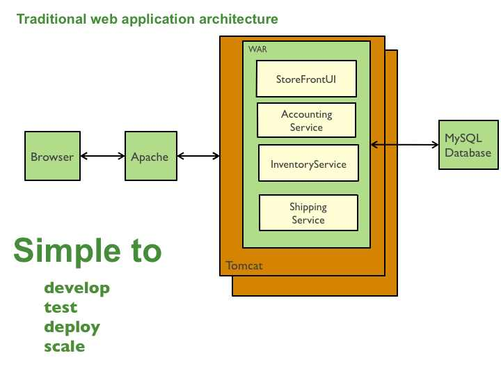

class: center, middle

# Docker - Why everyone talk about Docker ?
###@CoE PSU

---

# Me?

.right[]

```sh
$ who
> ibot.out
> http://fb.me/botblogblog
> https://github.com/ibotdotout
```
--

```sh
$ do
> Vim
> Git
> Python
> NodeJS
> Automated Testing
> Automated Workflow
> Dev-ops
> Docker
> Agile / XP
```


---
class: center, middle
# What is benefit of Docker ?
## build once, run anywhere

---

# [What is benefit of Docker ?](https://access.redhat.com/documentation/en-US/Red_Hat_Enterprise_Linux/7/html/7.0_Release_Notes/sect-Red_Hat_Enterprise_Linux-7.0_Release_Notes-Linux_Containers_with_Docker_Format-Advantages_of_Using_Docker.html)
- Rapid application deployment

- Portability across machines

- Sharing

- Simplified maintenance 

---

class: center, middle
# What is Docker ?
## Container is not lite weight VM

---

# [What is Docker ?](https://www.docker.com/what-docker)

 < VM  ----  Container > 

- a pieceof software in a complete filesystem that contains everything it needs to run: code, runtime, system tools,system libraries 

- This guarantees that it will always run the same, regardless of the environment it is running in.

---

# Docker Concept - [Credit](http://heiber.im/post/creating-a-solid-docker-base-image/)

.center[
```
+--------+     +--------+    +--------+
|C1      |     |C2      |    |C3      |
| Nginx  +-----+ NodeJS +----+ Redis  |
|        |     |        |    |        |
+--------+     +--------+    +--------+
```     
]

The concept Docker was intended for originally:
-  Isolated

- Single-process

- Easily distributable

- Lean images

---

# Docker Image vs Docker Containers
## like Class and Instance in OOP

.center[
```
3 Container from 1 Image
+--------+     +--------+    +--------+
|C1      |     |C2      |    |C3      |
| Nginx  |     |  Nginx |    | Nginx  |
|        |     |        |    |        |
+--------+     +--------+    +--------+
```     
]

---
# Docker Only Linux ?

* No, OSX and Window can run Docker.
* [Docker for Mac and Windows Beta](https://blog.docker.com/2016/03/docker-for-mac-windows-beta/) , native are coming.
* Now, using VM with Boot2Docker.

.right[
.left[
```
OSX / Windows

+-------------------------------------+
|Host                                 |
|                                     |
|  +------------------------------+   |
|  |Virtual Machine               |   |
|  |                              |   |
|  | +--------------------------+ |   |
|  | |Docker Engine             | |   |
|  | |                          | |   |
|  | |  +--------+  +---------+ | |   |
|  | |  |C1      |  |C2       | | |   |
|  | |  |        |  |         | | |   |
|  | |  +--------+  +---------+ | |   |
|  | +--------------------------+ |   |
|  +------------------------------+   |
|                                     |
+-------------------------------------+
```
]
]

```
Linux

+------------------------------+
|Host                          |
|                              |
| +--------------------------+ |
| |Docker Engine             | |
| |                          | |
| |  +--------+  +---------+ | |
| |  |C1      |  |C2       | | |
| |  |        |  |         | | |
| |  +--------+  +---------+ | |
| +--------------------------+ |
+------------------------------+
```

---

class: center, middle
# Beyond the Docker
## Docker Ecosystems

---

# [Docker Ecosystems](https://blog.codeship.com/understanding-the-docker-ecosystem/)

.right[]

- Docker Engine  

- Docker Registry / Hub  

- Docker Compose  

- Docker Machine  

- Docker Swarm  

- Docker Toolbox

---

class: center, middle
# Docker with Development
## Same config everywhere

---

class: center, middle
# Docker with Testing
## easy to change version

---

class: center, middle
# First touch with Docker
## Dockerfile and Docker Compose

---

# [Dockerfile](https://docs.docker.com/engine/reference/builder/) - [Best practices](https://docs.docker.com/engine/userguide/eng-image/dockerfile_best-practices/)

.right[
.left[
```
+-------------+
|L4           |
|   APP v1    |
+-------------+
|L3           |
|   PYTHON    |
+-------------+
|L2           |
|    CURL     |
+-------------+
|L1           |
|   Debian    |
+-------------+
```

```
+-------------+
|L5           |
|    APP v2   |
+-------------+
|L3           |
|   PYTHON    |
+-------------+
|L2           |
|    CURL     |
+-------------+
|L1           |
|   Debian    |
+-------------+
```
]
]

```sh
# Dockerfile
FROM debian:sid

RUN apt-get install curl
RUN apt-get install python

WORKDIR /apps

COPY hello.py /apps/hello.py

CMD python hello.py
```

```sh
# Dockerfile
FROM debian:sid

RUN apt-get install curl
RUN apt-get install python

WORKDIR /apps

COPY heyyo.py /apps/heyyo.py

CMD python heyyo.py
```


---

# [Docker Engine](https://docs.docker.com/engine/)

.right[]
Command

```sh
$ docker ps
$ docker images

$ docker built -t <image-name> .
$ docker rmi  <image-name>

$ docker run <image-name>
$ docker run -d <image-name>
$ docker run -it --rm  <image-name> <command>

$ docker exec -it <container-id> <command>

$ docker log <container-id>
$ docker inspect <container-id>
$ docker rm <container-id>

$ docker top <container-id>
$ docker stats <container-id>
```

---

# [Docker Compose](https://docs.docker.com/compose/)

.right[]

```sh
$ docker-compose build
$ docker-compose pull

$ docker-compose up -d
$ docker-compose -f production.yml up -d
$ docker-compose stop
$ docker-compose kill
$ docker-compose restart
$ docker-compose rm

$ docker-compose run --rm -it <name> <command>
$ docker-compose exec <name> <command>

$ docker-compose ps
$ docker-compose log -f
```

---

# [Manage data in containers](https://kvaes.wordpress.com/2016/02/11/docker-storage-patterns-for-persistence/)

```
1. Normal, Data inside Contaier
+------------------+
|C1                |
|     MongoDB      |
|                  |
|  +------------+  |
|  |    Data    |  |
|  +------------+  |
+------------------+
```

.right[
.left[
```sh
$ docker run -v $PWS:/app node
```
]
]

```
2. Mount to Host, using data from Host
+----------------------------+
|Host                        |
|    +------------------+    |
|    |Docker Engine     |    |
|    |   +----------+   |    |
|    |   |C2        |   |    |
|    |   |  MongoDB |   |    |
|    |   |          |   |    |
|    |   +----+-----+   |    |
|    |        |         |    |
|    +------------------+    |
|             |              |
|    +--------+---------+    |
|    |      Data        |    |
|    +------------------+    |
+----------------------------+
```

---

# [Manage data in containers](https://kvaes.wordpress.com/2016/02/11/docker-storage-patterns-for-persistence/) - 2

.right[
.left[
```sh
$ docker create -v /dbdata \
	--name dbstore busybox

$ docker run -d \
	--volumes-from dbstore \
	training/postgres
```
]
]

```
3. Data Container, use data from other Container
 +---------------+
 |C3             |
 |               |  +-----------+
 |               |  |C4         |
 |    MongoDB    |__|    Data   |
 |               |  |           |
 |               |  +-----------+
 +---------------+
```

.right[
.left[
```sh
$ docker volume create \
	--name my-named-volume

$ docker volume ls

$ docker volume inspect <volume>

$ docker run -v \
	my-named-volume:/opt/webapp \
	training/webapp python app.py
```
]
]

```
4. Docker Volume, using data from Docker Engine
+-------------------------+
|Docker Engine            |
|      +----------+       |
|      |C5        |       |
|      |  MongoDB |       |
|      |          |       |
|      +-----+----+       |
|            |            |
|   +--------+---------+  |
|   |      Data        |  |
|   +------------------+  |
+-------------------------+
```

---

# [Docker Network](https://docs.docker.com/engine/userguide/networking/dockernetworks/)
## Understand Docker container networks

.right[
.left[
```sh
$ docker run -p 3000:3000 node
$ docker run node

$ docker ps
```
]
]

```
+----------------------------------+
|Host                              |
|                                  |
|  +----------------------------+  |
|  |Docker Engine               |  |
|  |   +--------+  +---------+  |  |
|  |   |C1      |  |C2       |  |  |
|  |   | NodeJS |  | NodeJS  |  |  |
|  |   | P:3000 |  | P:3000  |  |  |
|  |   +--------+  +---------+  |  |
|  |    |P:28375    |P:28376    |  |
|  +----------------------------+  |
|       |                          |
|       |P:3000                    |
|       |                          |
+-------+--------------------------+
```

---
# [Docker Network](https://docs.docker.com/engine/userguide/networking/dockernetworks/) - 2

.right[
.left[
```sh
$ docker network ls
$ docker network inspect <network>
```
]
]

```
Communication between Container

+--------------------------------------------+
|Docker Engine                               |
|                                            |
| +--------------------------+               |
| |Docker Network            |               |
| |                          |               |
| | +--------+  +---------+  |  +----------+ |
| | |C1      |  |C2       |  |  |C3        | |
| | | NodeJS +--+  Mongo  |  |  |  NodeJs  | |
| | |        |  |         |  |  |          | |
| | +--------+  +---------+  |  +----------+ |
| |                          |               |
| +--------------------------+               |
|                                            |
+--------------------------------------------+
```
---

# [Docker Compose File](https://docs.docker.com/compose/compose-file/)
## Write docker-compose.yml

```sh
version: '2'

services:
  nginx:
    image: nginx:stable-alpine
    volumes:
      - ./nginx.conf:/etc/nginx/nginx.conf
    depends_on:
      - web
    ports:
      - "8080:80"

  web:
    build: .
    depends_on:
      - redis

  redis:
    image: redis
```

---

class: center, middle
# First touch with Docker
## Workshop and Demo

---

class: center, middle
# Docker to the Cloud
## Docker Machine and Swarm

---

# [Docker Machine](https://www.docker.com/products/docker-machine)

.right[]

```sh
# create on local
$ docker-machine create -d virtualbox dev

# create on cloud
$ docker-machine create --driver digitalocean \
	--digitalocean-access-token=secret \
	--digitalocean-size 2gb \
	--digitalocean-region sgp1 \
	--digitalocean-image ubuntu-14-04-x64 \
	docean

# docker-machine command
$ docker-machine start <machine-name>
$ docker-machine stop <machine-name>
$ docker-machine restart <machine-name>
$ docker-machine kill <machine-name>
$ docker-machine ssh <machine-name>
$ docker-machine ip <machine-name>
$ docker-machine env <machine-name>
```

---


# [Docker Swarm](https://www.docker.com/products/docker-swarm)

.right[]
Create Swarm by Docker-machine

```sh
# create swarm master
$ docker-machine create \
  -d virtualbox \
  --swarm \
  --swarm-master \
  --swarm-discovery token:// \
  swarm-master

# create swarm slave
$ docker-machine create \
  -d virtualbox \
  --swarm \
  --swarm-discovery token:// \
  swarm-node-00
```

---

# [Docker Swarm](https://www.docker.com/products/docker-swarm)

.center[]

---

class: center, middle
# Docker to the Cloud
## Demo

---

class: center, middle
# Docker and Microseriver
## Monolithic vs Microservices Architecture

---

# [Monolithic Architecture](http://microservices.io/patterns/monolithic.html)

.center[]

---

# [Microservices Architecture](http://microservices.io/patterns/microservices.html)

.center[]

---

# References:

### Overview about  Software Container / Docker Concept
- [Containers and Future Generations of Clouds - Video Thai](http://www.thaiopenstack.org/conference2016/dr-chanwit-kaewkasi/)

### Where to start ?
- [Docker : ฉบับปูพื้น](http://www.jaynarol.com/what-is-docker/)
- [Docker : ติดตั้งและเริ่มใช้งาน (อย่างเข้าใจ)](http://www.jaynarol.com/understand-docker/)
- [dwyl/learn-docker](https://github.com/dwyl/learn-docker)
- [Awesome-docker -  A curated list of Docker resources and projects](http://veggiemonk.github.io/awesome-docker/)
- [Get Started with Docker](http://docker.com/tryit)
- [Codemy School - Docker for Developers](https://www.youtube.com/playlist?list=PLjQo0sojbbxViGEbI_87SPXpb3neuVqDL)
- [Docker Engine user guide](https://docs.docker.com/engine/userguide/)
- [Docker Training >  Self-Paced Training](https://training.docker.com/self-paced-training)
- [Get started with Docker Machine and a local VM](https://docs.docker.com/machine/get-started/)
- [Docker Volume](https://docs.docker.com/engine/userguide/containers/dockervolumes/)
